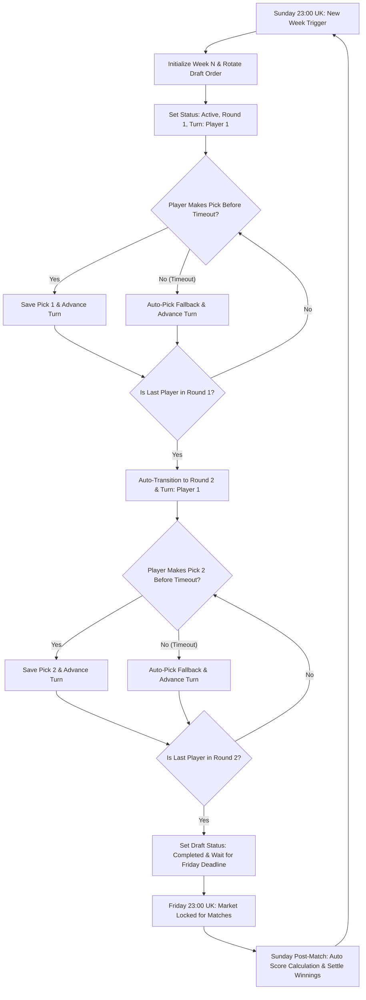

# COUPON BUSTERS: LEAGUE & SYNDICATE AUTOMATION SPECIFICATION
> **Master Technical & Operational Blueprint for AI Agent Implementation**
> *Document Version: 2.0 | Last Updated: 2026-07-29*

---

## 1. Executive Summary

**Coupon Busters** is a high-stakes, social football syndicate and betting application. Players join private/public syndicates to pool entry fees weekly, divide funds into **accumulating savings pots** and **real-world accumulator bets**, and participate in a live, turn-based drafting system.

### Core Objectives for AI Agent Implementation:
1. **End-to-End Automation**: Eliminate manual admin bottlenecks (auto-generate game weeks, auto-start drafts, auto-handover turns, auto-rotate draft order, auto-close/open market windows, auto-fetch match scores, auto-settle bets).
2. **Uncompromising Fairness**: Enforce fair draft order rotation week-over-week, turn timers with anti-stall auto-picks, strict single-use team picking across the syndicate, and server-side validation to prevent cheating.
3. **Dual-Layer Betting & Scoring**: Seamlessly manage **Round 1 (Banker)** and **Round 2 (Cover)** selections across 22 global leagues with strict eligibility filters.

---

## 2. Domain Data Architecture & DB Schema

### 2.1 Entity Model (Firestore / Database)

```typescript
// ==========================================
// 1. USER PROFILE
// ==========================================
export enum UserRole {
  USER = 'user',
  LEAGUE_ADMIN = 'league-admin',
  GLOBAL_ADMIN = 'global-admin',
}

export interface User {
  id: string;                      // Firebase Auth UID
  email: string;
  display_name: string;
  role: UserRole;
  wallet_balance_pence: number;     // e.g. 5000 = £50.00
  avatar_url?: string;
  created_at: string;
}

// ==========================================
// 2. LEAGUE (SYNDICATE)
// ==========================================
export interface League {
  id: string;                      // Unique Syndicate ID
  name: string;                    // e.g. "South Wales Elite"
  owner_id: string;                // User ID of creator
  league_admins?: string[];        // Array of co-admin User IDs
  privacy: 'public' | 'private';
  weekly_fee_pence: number;        // Total weekly entry fee (e.g. 2000 = £20.00)
  pot_deduction_pence: number;     // Saved into long-term pot (e.g. 200 = £2.00)
  current_pot_pence: number;       // Total accumulated savings pot
  max_players: number;             // Capacity cap (e.g. 20)
  start_date: string;              // ISO date
  pick_deadline_day: number;       // 0=Sun, 1=Mon, ..., 5=Fri (Default: 5)
  pick_deadline_hour: number;      // 0-23 (Default: 23 = 11:00 PM UK)
  enable_automatic_deadlines: boolean; // true = Automated UK timetable, false = Manual mode
  market_manual_open?: boolean;    // Used when enable_automatic_deadlines === false
  turn_time_limit_seconds?: number;// e.g. 120s turn clock to prevent draft stalling
}

// ==========================================
// 3. LEAGUE MEMBER
// ==========================================
export interface LeagueMember {
  id: string;                      // Unique Member Record ID
  league_id: string;
  user_id: string;
  status: 'pending' | 'approved' | 'rejected';
  is_admin: boolean;
  joined_at: string;               // Timestamp used for initial Week 1 draft order
  points: number;                  // Total accumulated season points
  wins: number;                    // Total weekly winning picks
  adjustment_points?: number;      // Manual admin bonus/penalty points
}

// ==========================================
// 4. GAME WEEK
// ==========================================
export interface Week {
  id: string;                      // Unique Week ID
  league_id: string;
  week_number: number;             // 1, 2, 3, ...
  status: 'open' | 'closed' | 'pending_admin' | 'approved';
  deadline_at: string;             // ISO timestamp (Friday 23:00 UK time)
  pick_order: string[];            // Array of User IDs defining exact turn sequence
  custom_draft_order?: string[];   // Admin override for Week 1 initial sequence
  current_turn_user_id: string | null; // User currently on the clock
  turn_deadline_at?: string;       // Timestamp when current user's turn expires
  draft_round: 1 | 2;              // 1 = Banker Round, 2 = Cover Round
  draft_status: 'upcoming' | 'active' | 'paused' | 'completed';
  coupon_winnings_pence?: number;  // Real money won on weekend accumulator
}

// ==========================================
// 5. PICKS (SELECTIONS)
// ==========================================
export interface Pick {
  id: string;                      // Format: `${week_id}_${user_id}`
  week_id: string;
  user_id: string;
  pick1_team_id?: string;          // Round 1: Banker Pick ID
  pick2_team_id?: string;          // Round 2: Cover Pick ID
  submitted_at: string;
  pick1_won?: boolean;             // Computed post-weekend
  pick2_won?: boolean;             // Computed post-weekend
  points_awarded?: number;         // 0, 1, or 2 points
}

// ==========================================
// 6. TEAMS & MATCH RESULTS
// ==========================================
export interface Team {
  id: string;                      // e.g. 'pl-ars'
  name: string;                    // e.g. 'Arsenal'
  country: string;                 // e.g. 'England'
  league_id: string;               // e.g. 'pl'
  logo_url?: string;
}

export interface MatchResult {
  team_id: string;
  opponent: string;
  score: string;                   // e.g. "2-1"
  won: boolean;
}
```

---

## 3. League Hierarchy & Selection Rules

The application supports **22 Global Football Leagues** categorized into two tiers:

### 3.1 Banker Leagues (9 Top Tier)
1. Premier League (`pl`) - England
2. Championship (`ch`) - England
3. League 1 (`l1`) - England
4. League 2 (`l2`) - England
5. Scottish Premiership (`spl`) - Scotland
6. La Liga (`laliga`) - Spain
7. Bundesliga (`bundesliga`) - Germany
8. Serie A (`seriea`) - Italy
9. Ligue 1 (`ligue1`) - France

### 3.2 Cover Leagues (13 Secondary Tier)
1. Süper Lig (`superlig`) - Turkey
2. Liga Portugal (`portugal`) - Portugal
3. Jupiler Pro League (`jupiler`) - Belgium
4. Eredivisie (`eredivisie`) - Netherlands
5. Super League Greece (`greek`) - Greece
6. Swiss Super League (`swiss`) - Switzerland
7. Austrian Bundesliga (`austrian`) - Austria
8. Danish Superliga (`danish`) - Denmark
9. Eliteserien (`norwegian`) - Norway
10. Allsvenskan (`swedish`) - Sweden
11. Czech First League (`czech`) - Czech Republic
12. HNL (`croatian`) - Croatia
13. Ekstraklasa (`polish`) - Poland

### 3.3 Strict Selection Eligibility Rules
* **Round 1 (Banker Pick)**:
  * MUST be picked ONLY from the **9 Banker Leagues**.
  * Represents the primary selection used for both syndicate points AND the real-world accumulator bet.
* **Round 2 (Cover Pick)**:
  * Allowed from ALL leagues EXCEPT 9 specific excluded leagues (`greek`, `swiss`, `austrian`, `danish`, `norwegian`, `swedish`, `czech`, `croatian`, `polish`).
  * Represents the insurance selection used for league leaderboard points only.
* **Global Team Uniqueness Constraint**:
  * **No two members in the same Syndicate can select the SAME team in the SAME week.**
  * Once Team X is picked by Member A (in either Round 1 or Round 2), Team X is immediately locked out and unavailable for all other members for that game week.

---

## 4. Complete Draft Engine & Automation Workflow



### 4.1 Week 1 Setup & Customization
1. **Default Order**: Sorted by `joined_at` timestamp ("First in, first pick").
2. **Admin Pre-Draft Phase**:
   * Admin can manually reorder players or click **Randomize** (Fisher-Yates shuffle).
   * Once Admin clicks **"Start League Draft"**, the Week 1 draft order is permanently locked.

### 4.2 Automated Draft Order Rotation (Week 2+)
To guarantee complete fairness over the course of a 38-week season, the pick sequence **auto-rotates** every week using a circular shift algorithm:

$$\text{Order}_{\text{Week } N+1} = [\text{User}_2, \text{User}_3, \dots, \text{User}_M, \text{User}_1]$$

* **Example**:
  * Week 1 Order: `[Alice, Bob, Charlie, Dave]`
  * Week 2 Order: `[Bob, Charlie, Dave, Alice]`
  * Week 3 Order: `[Charlie, Dave, Alice, Bob]`
* **Fairness Principle**: Every single player moves up 1 slot each week and gets an equal number of 1st overall picks.

### 4.3 Turn Handover & Anti-Stall Engine
* When the active player selects a team, a Firestore atomic transaction:
  1. Verifies `request.auth.uid === week.current_turn_user_id`.
  2. Verifies the team is available via `getAvailableTeams()`.
  3. Writes/updates the `picks` document.
  4. Advances `current_turn_user_id` to `pick_order[currentIndex + 1]`.
* **Auto Round Transition**:
  * When `currentIndex === pick_order.length - 1` (last player in Round 1):
  * App automatically sets `draft_round = 2` and resets `current_turn_user_id = pick_order[0]`.
  * When last player in Round 2 completes their pick: `draft_status = 'completed'` and `current_turn_user_id = null`.
* **Turn Timer & Auto-Pick Safeguard**:
  * Each turn is given a deadline (`turn_deadline_at = now + 120s`).
  * If a user fails to select a team before `turn_deadline_at`, a cloud scheduler function automatically executes an **Auto-Pick**:
    * Filters available teams for the current round.
    * Selects the highest available team by team ID (or random selection).
    * Submits the pick and advances the turn automatically.

---

## 5. Market Windows & Time Scheduling (UK Time)

All automatic deadline calculations must strictly operate in the **`Europe/London`** timezone (handling GMT and BST daylight savings adjustments seamlessly).

### 5.1 Automated Market Schedule (UK Time)

| Window Phase | Day & Time (UK) | Market Status | System Behavior |
| :--- | :--- | :--- | :--- |
| **Drafting Window** | **Sunday 23:00 to Friday 23:00** | **OPEN** | Members enter Draft Room, make selections in turn order. |
| **Pick Lockout** | **Friday 23:00** | **LOCKED** | Draft room closes. All un-drafted slots trigger emergency auto-pick. |
| **Match Execution** | **Friday 23:00 to Sunday 23:00** | **CLOSED** | Real-world football matches occur. No picks modified. |
| **Settlement & Reset** | **Sunday 23:00** | **AUTO-RESET** | Match scores fetched, picks evaluated, points/pot updated, Week N+1 created. |

### 5.2 Manual Override Mode
* If `enable_automatic_deadlines === false`, the automated timer is disabled.
* League Admin can toggle `market_manual_open` (`true` / `false`) directly from the Admin Console to pause or open picking at will.

---

## 6. Financial Architecture & Syndicate Mathematics

Every syndicate enforces a clear 3-way split of member funds:

```
[Weekly Entry Fee] = [Accumulated Savings Pot Deduction] + [Net Accumulator Stake]
```

### 6.1 Mathematical Formulation

For a Syndicate with $M$ approved members:
1. **Weekly Fee Per Player**: $F = \text{weekly\_fee\_pence}$ (e.g. £20.00 = 2000p)
2. **Pot Deduction Per Player**: $P = \text{pot\_deduction\_pence}$ (e.g. £2.00 = 200p)
3. **Net Betting Stake Per Player**: $S = F - P = 2000p - 200p = 1800p$ (£18.00)
4. **Total Weekly Syndicate Accumulator Stake**:
   $$\text{Stake}_{\text{Total}} = M \times (F - P)$$
5. **Weekly Pot Addition**:
   $$\text{Pot}_{\text{Addition}} = M \times P$$
6. **New Saved Pot Balance**:
   $$\text{Pot}_{\text{New}} = \text{Pot}_{\text{Current}} + \text{Pot}_{\text{Addition}}$$

* **Real-World Bet Coupon**: The Banker picks from all $M$ members form an $M$-fold real-world accumulator bet with total stake $\text{Stake}_{\text{Total}}$.
* **Winnings Payout**: If the real accumulator wins, `coupon_winnings_pence` is distributed equally among all active members or deposited into syndicate balances.

---

## 7. Automated Match Settlement & Scoring Engine

### 7.1 Scoring Rules
* **Banker Pick (Pick 1)** Won match: **+1 Point**
* **Cover Pick (Pick 2)** Won match: **+1 Point**
* **Max Points Per Member Per Week**: **2 Points**
* **Loss or Draw**: **0 Points** (unless specific league rules dictate draw points)

### 7.2 Leaderboard Ranking & Tie-Breakers
Members are sorted on the Syndicate Leaderboard according to the following strict hierarchy:
1. **Total Points** ($\text{Points} + \text{Adjustment Points}$) — *Descending*
2. **Total Weekly Wins** ($\text{Wins}$) — *Descending*
3. **Joined Date** ($\text{joined\_at}$) — *Ascending (Earliest member higher)*

---

## 8. Firestore Security Rules & Anti-Cheat Specifications

To prevent spoofing or unauthorized draft manipulation, the following rules must be enforced in `firestore.rules`:

```javascript
rules_version = '2';
service cloud.firestore {
  match /databases/{database}/documents {
    
    // Helper Functions
    function isAuthenticated() {
      return request.auth != null;
    }
    
    function isLeagueAdmin(leagueId) {
      let league = get(/databases/$(database)/documents/leagues/$(leagueId)).data;
      return isAuthenticated() && (league.owner_id == request.auth.uid || request.auth.uid in league.league_admins);
    }
    
    // Picks Validation
    match /picks/{pickId} {
      allow read: if isAuthenticated();
      allow create, update: if isAuthenticated() 
        && request.resource.data.user_id == request.auth.uid;
      allow delete: if isAuthenticated() && isLeagueAdmin(resource.data.league_id);
    }
    
    // Weeks Validation
    match /weeks/{weekId} {
      allow read: if isAuthenticated();
      allow create, update: if isAuthenticated();
    }
    
    // Members Validation
    match /members/{memberId} {
      allow read: if isAuthenticated();
      allow create: if isAuthenticated() && request.resource.data.user_id == request.auth.uid;
      allow update, delete: if isAuthenticated();
    }
    
    // Leagues Validation
    match /leagues/{leagueId} {
      allow read: if isAuthenticated();
      allow create: if isAuthenticated();
      allow update, delete: if isAuthenticated();
    }
  }
}
```

---

## 9. Codebase Integration Guide for App AI Agent

When implementing or modifying features in the main app codebase, refer to the following explicit file map:

### 9.1 File Map & Responsibilities

| Target File | Primary Responsibilities & Functions to Update/Create |
| :--- | :--- |
| **`src/types.ts`** | Complete data definitions (`League`, `Week`, `Pick`, `LeagueMember`, `Team`, `MatchResult`). Ensure `turn_deadline_at` and `turn_time_limit_seconds` fields are declared. |
| **`src/utils/draftLogic.ts`** | Contains `getInitialDraftOrder()`, `rotateWeeklyOrder()`, `getAvailableTeams()`, and `processTurnHandover()`. Update `processTurnHandover` to auto-advance to Round 2 without requiring manual admin pause. |
| **`src/utils/scheduler_uk.ts`** | Calculates `calculateLeagueWindow()` using `Europe/London` timezone. Controls automatic open/closed market state. |
| **`src/utils/scoring.ts`** | Contains `calculateWeeklyScore()` and `formatCurrency()`. Evaluates Pick 1 and Pick 2 match results against real scores. |
| **`src/components/DraftRoom.tsx`** | Live draft user interface. Handles league selection, team grid filtering, turn indicators, turn clock countdown, and pick submission handlers. |
| **`src/pages/Dashboard.tsx`** | Main player dashboard. Enforces membership verification, calculates real-time market window, runs atomic transaction for pick submissions. |
| **`src/pages/Admin.tsx`** | Syndicate admin control center. Handles Week 1 custom draft ordering/randomization, manual override toggles, pot management, and global league reset. |
| **`firestore.rules`** | Database access security rules enforcing single-pick integrity and turn validation. |

---

## 10. Verification & Quality Checklist for Implementation

When the AI Agent completes updates, run the following verification checks:

- [ ] **Week 1 Draft Creation**: Verify admin can randomize or custom order Week 1 draft before clicking "Start League Draft".
- [ ] **Turn Handover**: Verify picking a team immediately advances the turn to the next user in `pick_order`.
- [ ] **Automatic Round Transition**: Verify that when the last user in Round 1 picks, the draft automatically switches to Round 2 and sets turn to the first user.
- [ ] **Single Team Use Enforcement**: Verify that once a team is picked in a week, it disappears from available teams for ALL other users in that syndicate.
- [ ] **Week-over-Week Rotation**: Verify that generating Week 2 shifts the pick order `[1, 2, 3] -> [2, 3, 1]`.
- [ ] **Timezone Enforcement**: Verify market closes at 23:00 UK time on Friday and opens at 23:00 UK time on Sunday.
- [ ] **Financial Calculations**: Verify Pot deduction (£2) and net stake (£18) calculate accurately in UI display and database updates.

---
*End of Master Technical Blueprint. Feed this file directly into your application AI agent to execute league system automation.*
